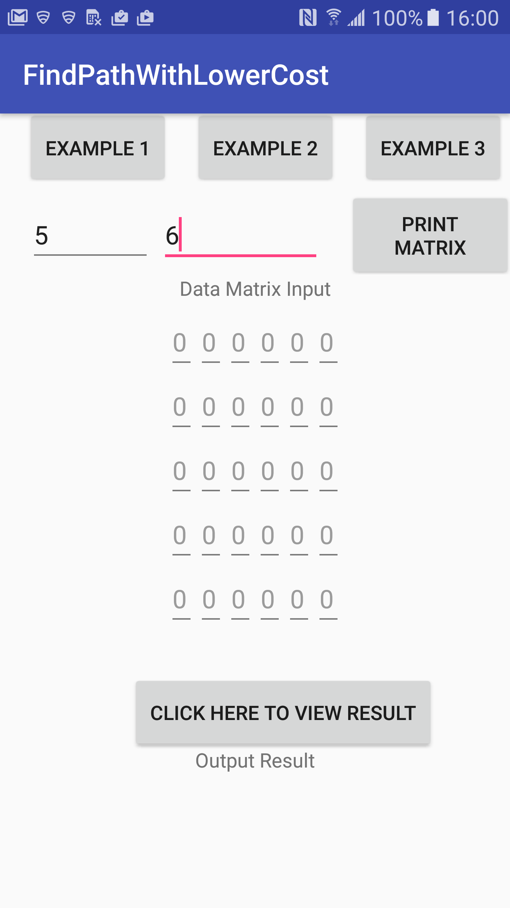

# FindPathWithLowerCost

1. Click on Example button for input sample data and click on RESULT button to get the result 

2. Or you can input the data or youselft by input number of row and number of column after input the data matrix click the RESULT button

=> The Result show the the top left of RESULT button : Check if have path going throught, The cost of path and the path. 
